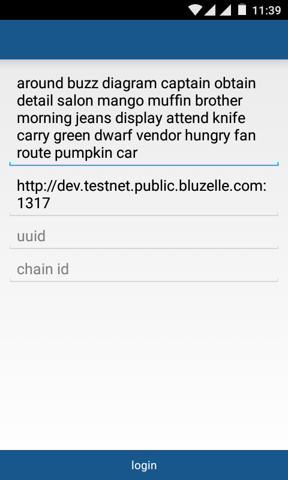
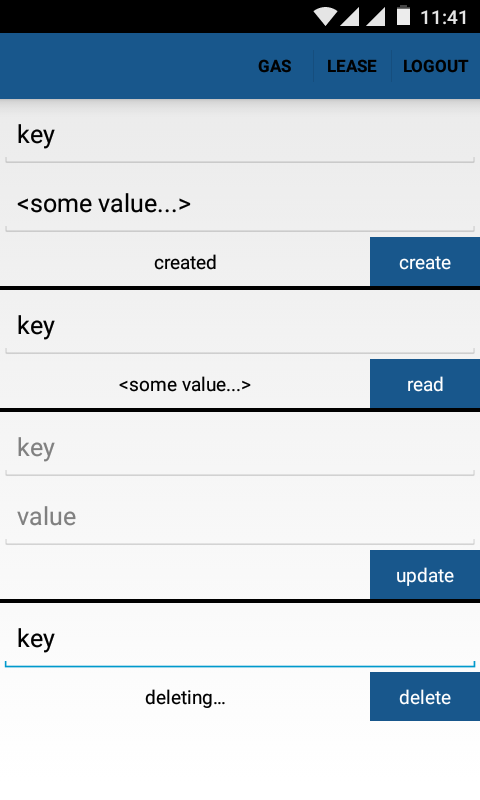
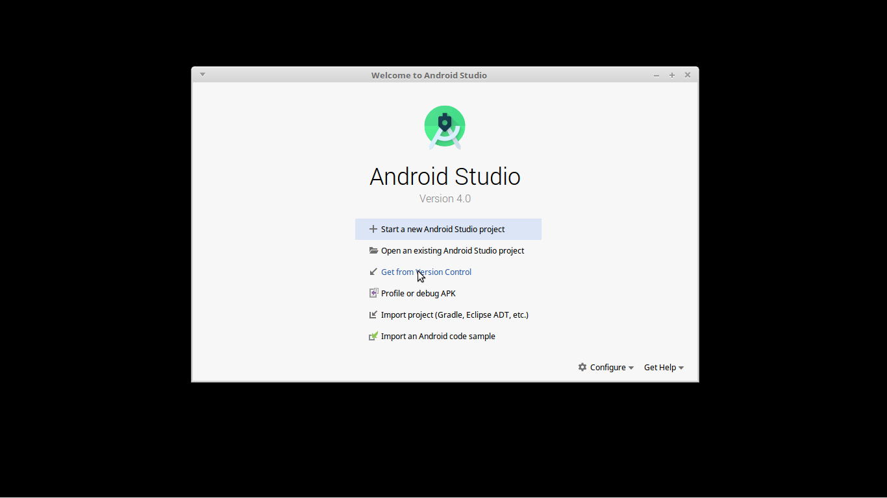
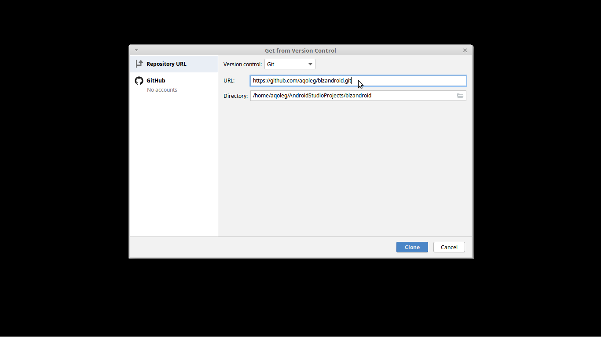
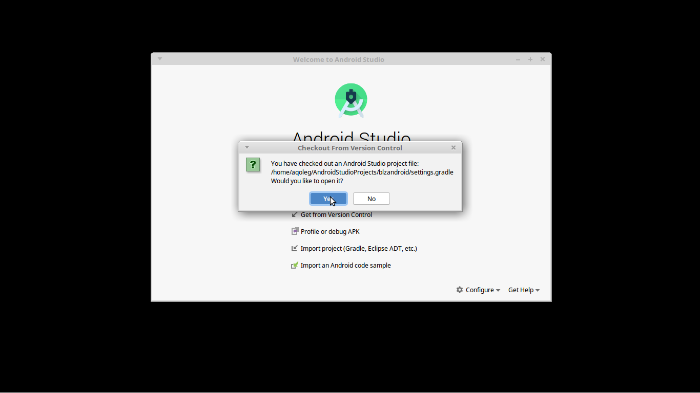
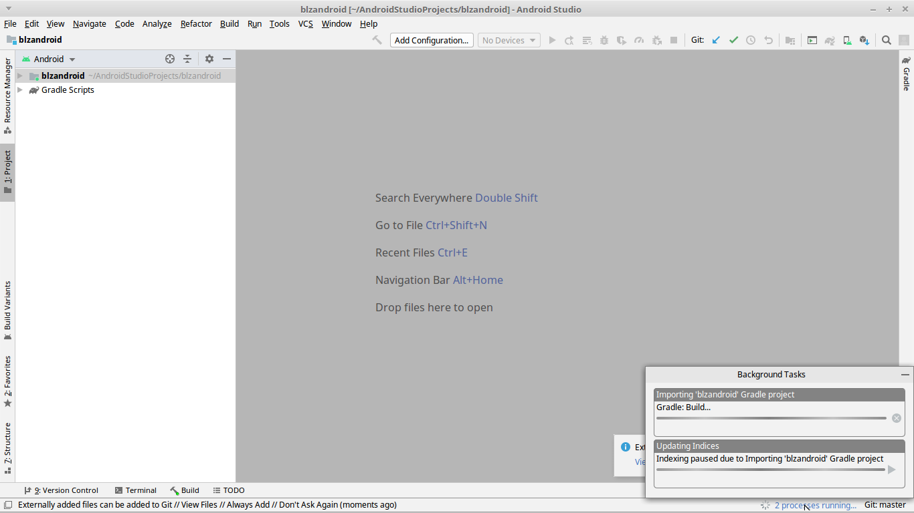
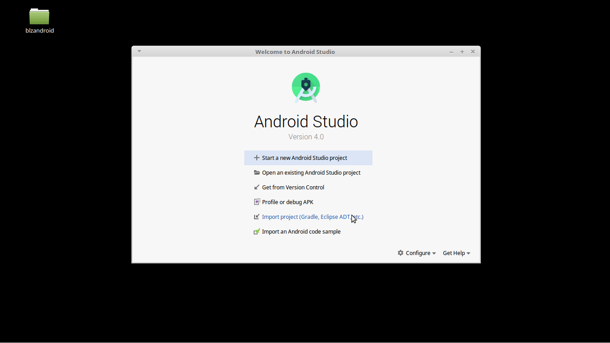
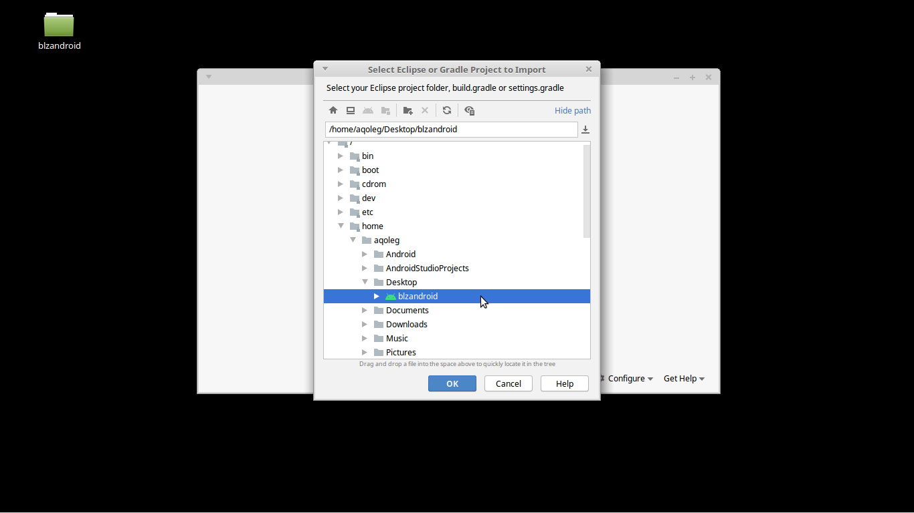
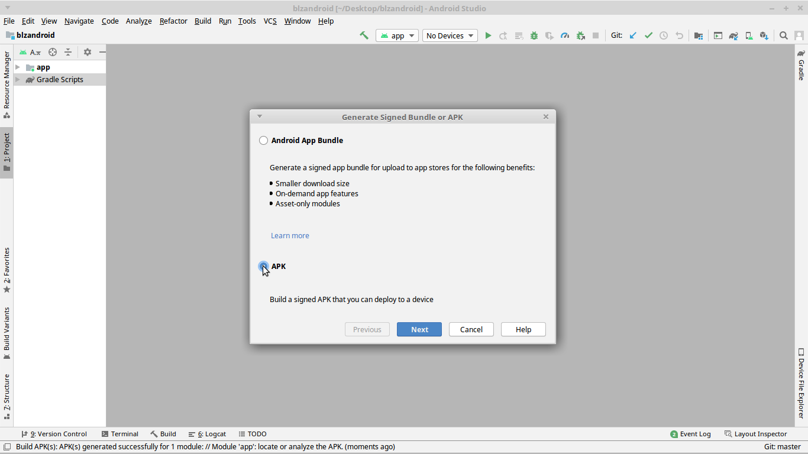
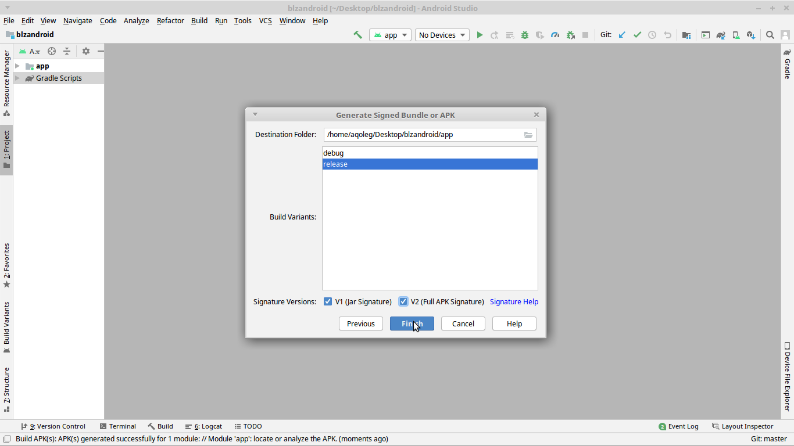

# Bluzelle Android

    

## Install IDE

Follow instructions to install the latest [Android Studio](https://developer.android.com/studio/install).

## Start project

Use one of the following two options to start a new project.

### Option 1

Open Android Studio. Select 'Get from Version Control'.

Or select **File** > **New** > **Project from Version Control...**.

Enter URL 'https://github.com/aqoleg/blzandroid.git'.

Open.

Wait for the project to be imported and updated.

### Option 2

Get the package from github.

    $ git clone https://github.com/aqoleg/blzandroid.git

Open Android Studio. Select 'Import project'.

Or select **File** > **New** > **Import Project...**.

Select the root of the package.

Wait for the project to be imported and updated.

## Build

Build debug or release APK.

### Debug

Select **Build** > **Build Bundle(s) / APK(s)** > **Build APK(s)**.

Wait for the project to be built.

### Release

Select **Build** > **Generate Signed Bundle / APK...**.

Select 'APK'.

Choose existing key or create new key. Select 'release' and check both signature versions.

Wait for the project to be built.

### Launch

Download this example of the android [app](https://github.com/aqoleg/blzandroid/releases/download/0.5.0/bluzelle.apk).

Activate the option **Settings** > **Security** > **Unknown sources** in the android device to launch this apk.

